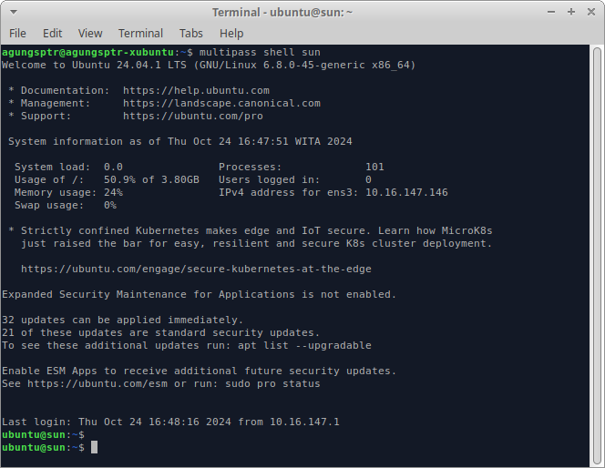

# Docker Swarm Tutorial

This tutorial will use simple backend app with can post or get data, and deploy it using docker swarm with multiple replicas. Also setting up monitoring docker swarm using swarmpit.io.

## Setting Up VM (Virtual Machine)

I am gonna use `multipass` to create VM. For multipass installation you can follow this [multipass.run](https://multipass.run). After installation multipass you can continue this tutorial. In this tutorial we will create 4 instance VM, 1 for manager and 3 for worker.

### Launch VM Instance

To laundh VM instance using multipass you can use multipass GUI after installation or simply use this command.

```sh
  multipass launch --name <name> --cpus 1 --memory 1G --disk 5G
```

Lets start with manager VM, I personally use `Sun` for named the manager VM and other planets as worker VM.

```sh
  multipass launch --name sun --cpus 1 --memory 1G --disk 5G
  multipass launch --name mars --cpus 1 --memory 1G --disk 5G
  multipass launch --name jupiter --cpus 1 --memory 1G --disk 5G
  multipass launch --name saturn --cpus 1 --memory 1G --disk 5G
```

After all VM launched, now we need to connect to the instance one by one and install `docker` on it.

### Install Dokcer in Each VM

To connect to the vm you can simply use this command.

```sh
  mutlipass shell <instance_name>
```

For example we connect to manger VM.

```sh
  multipass shell sun
```

