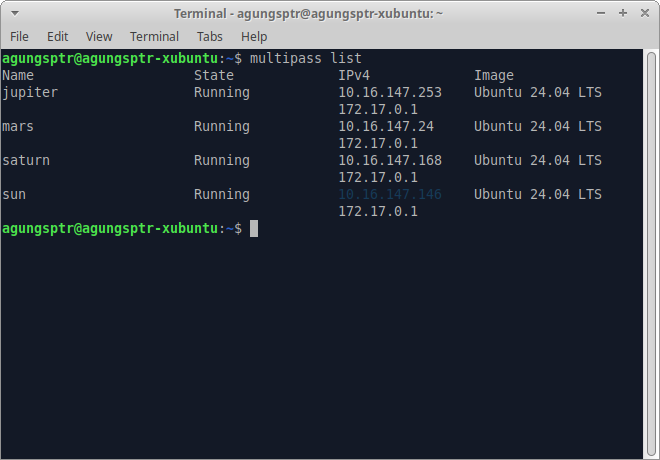
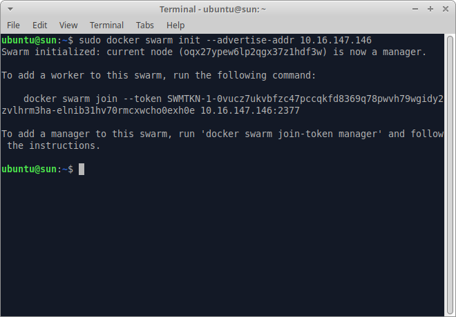
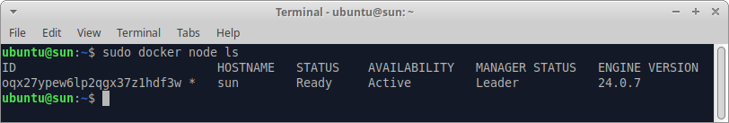
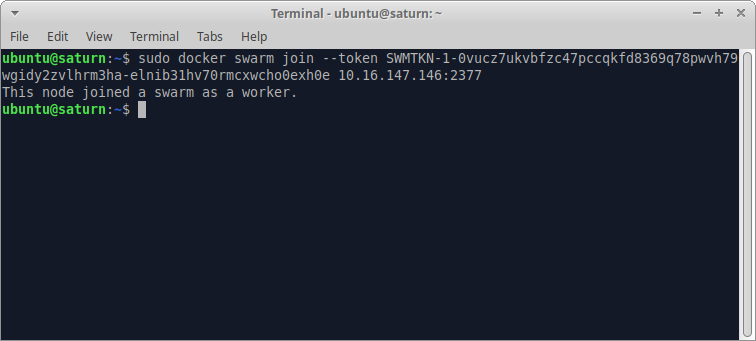
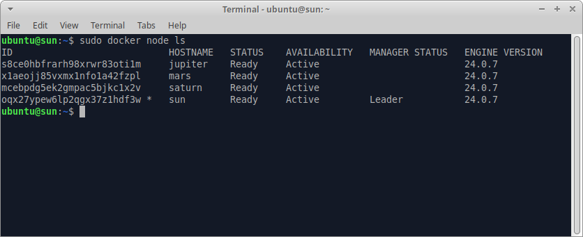

# Docker Swarm Tutorial

This tutorial will use simple backend app with can post or get data, and deploy it using docker swarm with multiple replicas. Also setting up monitoring docker swarm using swarmpit.io.

## Setting Up VM (Virtual Machine)

I am gonna use `multipass` to create VM. For multipass installation you can follow this [multipass.run](https://multipass.run). After installation multipass you can continue this tutorial. In this tutorial we will create 4 instance VM, 1 for manager and 3 for worker.

### Launch VM Instance

To laundh VM instance using multipass you can use multipass GUI after installation or simply use this command.

```sh
  multipass launch --name <name> --cpus 1 --memory 1G --disk 5G
```

Lets start with manager VM, I personally use `Sun` for named the manager VM and other planets as worker VM.

```sh
  multipass launch --name sun --cpus 1 --memory 1G --disk 5G
  multipass launch --name mars --cpus 1 --memory 1G --disk 5G
  multipass launch --name jupiter --cpus 1 --memory 1G --disk 5G
  multipass launch --name saturn --cpus 1 --memory 1G --disk 5G
```

After all VM launched, now we need to connect to the instance one by one and install `docker` on it.

## Install Dokcer in Each VM

To connect to the vm you can simply use this command.

```sh
  mutlipass shell <instance_name>
```

For example we connect to manger VM.

```sh
  multipass shell sun
```


After that we need to install the docker.

```sh
  sudo apt update & sudo apt install -y docker.io
```

Make sure docker installed success, check docker installation

```sh
  docker --version
```

If you see the result it was success installed.

## Create Swarm

Before we creating docker swarm we need to know the manager IP. You can use this command and see for manager VM.

```sh
  multipass list
```



In this case we get the manager IP is `10.16.147.146`.

Now we need to open manager VM, for this example we open `sun` VM, and run this command to create new swarm.

```sh
  docker swarm init --advertise-addr <MANAGER-IP>
```



If you see all node running the swarm

```sh
  docker node ls
```



You can see the manager is running on that. 

## Join Worker VM with Swarm

So next we need to add the worker to manager, you can follow the command show after create the swarm. In this case we need to run the command this below on worker VM.

```sh
  docker swarm join --token SWMTKN-1-0vucz7ukvbfzc47pccqkfd8369q78pwvh79wgidy2zvlhrm3ha-elnib31hv70rmcxwcho0exh0e 10.16.147.146:2377
```

Lets connect to worker VM

```sh
  multipass shell saturn
```

Now we run the command above to join the worker to manager swarm, and now it should be like this below.



Repeat this to all worker that we have. After that we can see list of node join to our swarm.

.

Now we are ready to deploy our app to the swarm.